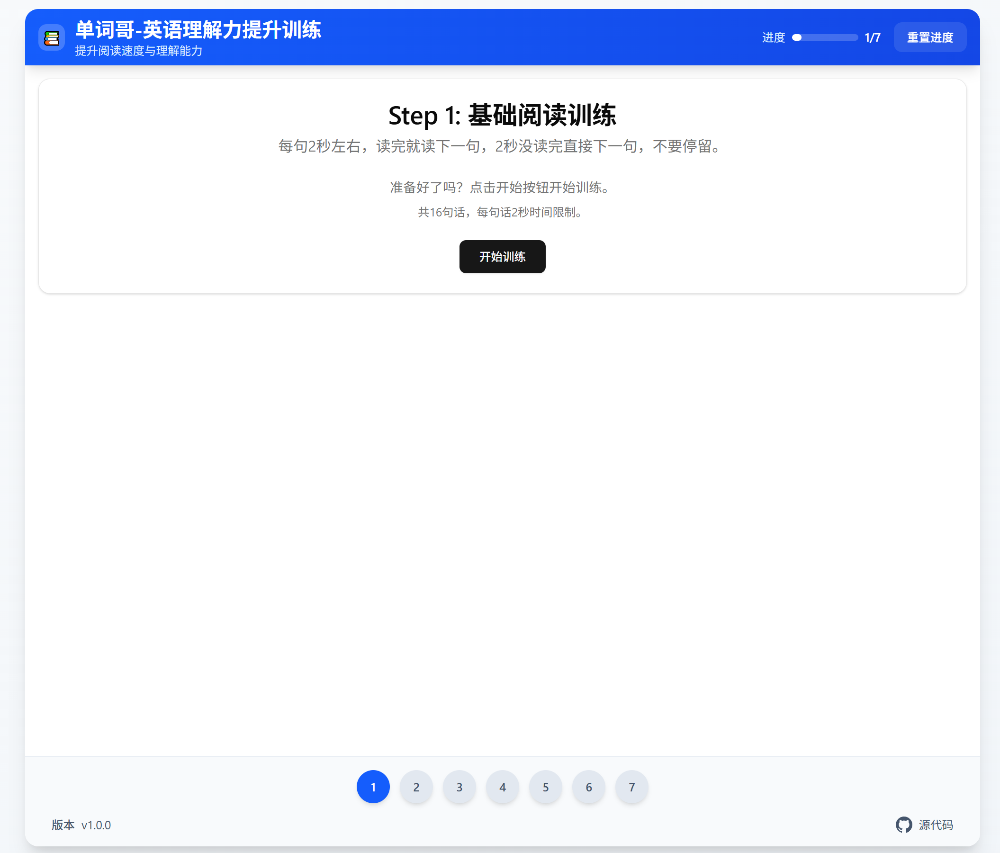

# 单词哥-英语理解力训练应用

把单词哥的英语理解训练方法vibe-coding搞出来了, 分享给大家。

在线访问: [https://vibe-english-understanding.fun](https://vibe-english-understanding.fun)
- 训练步骤原文请在小红书搜索“单词哥”，或者访问本仓库的文件：[理解力提升操作步骤-单词哥](理解力提升操作步骤-by单词哥.md) 

有问题请随时提出issues或pull requests。

## ✨ 功能特性



- **7步训练程序**：全面的训练方法论，提升英语理解能力
- **PC端支持**：提供桌面端优化体验
- **移动端适配**：支持手机和平板设备，随时随地学习

## 本地运行
### 环境要求

- Node.js（18或更高版本）
- npm或yarn包管理器

### 安装步骤

1. 克隆仓库：
```bash
git clone https://github.com/your-username/vibe-english-understanding.git
cd vibe-english-understanding
```

2. 安装依赖：
```bash
npm install
```

3. 启动开发服务器：
```bash
npm run dev
```

4. 打开浏览器访问 `http://localhost:5173`

## 🏗️ 技术栈

- **React 19** - UI框架
- **TypeScript** - 类型安全和开发体验
- **Vite** - 快速构建工具和开发服务器
- **Tailwind CSS** - 实用优先的CSS框架
- **Radix UI** - 无障碍UI组件
- **Lucide React** - 图标库

## 📁 项目结构

```
src/
├── components/
│   ├── steps/           # 训练步骤组件 (Step1-Step7)
│   ├── ui/              # 可复用UI组件
│   ├── Sidebar.tsx      # 导航侧边栏
│   ├── PracticeMode.tsx # 练习模式组件
│   ├── ProgressStats.tsx # 进度统计
│   └── Settings.tsx     # 应用设置
├── hooks/
│   ├── useProgress.ts   # 进度管理钩子
│   └── useTimer.ts      # 计时器功能钩子
├── data/
│   └── sentences.ts     # 训练内容和句子
├── types/
│   └── index.ts         # TypeScript类型定义
└── App.tsx              # 主应用组件
```

## 🔧 可用脚本

- `npm run dev` - 启动开发服务器
- `npm run build` - 构建生产版本
- `npm run preview` - 预览生产构建
- `npm run lint` - 运行ESLint进行代码质量检查


## 📄 许可证

本项目采用MIT许可证 - 详见[LICENSE](LICENSE)文件。

## 🙏 致谢

- 小红书搜索: 单词哥